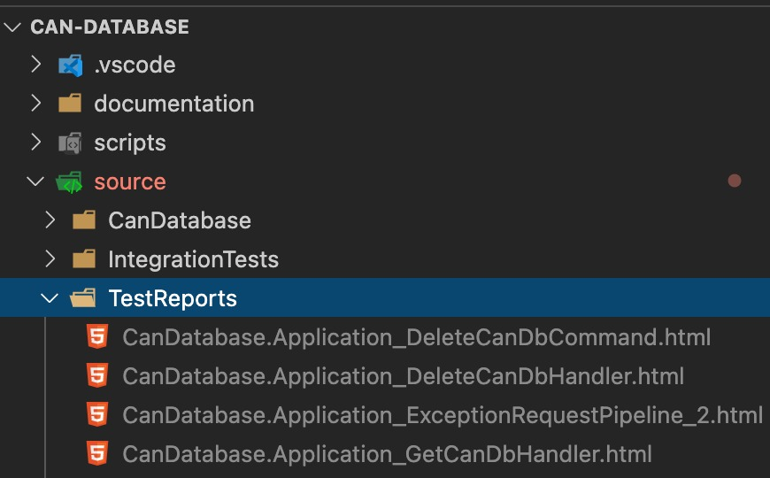
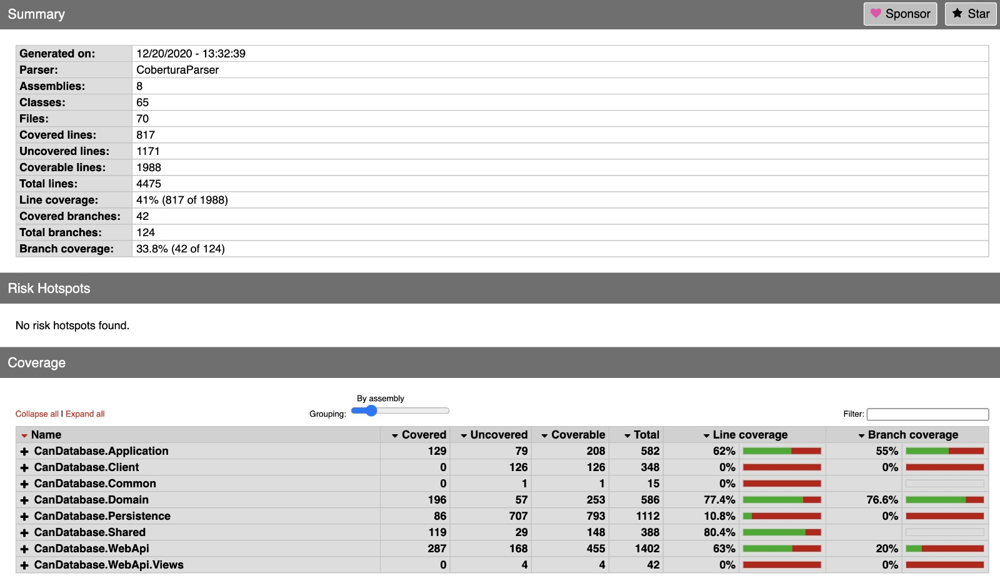
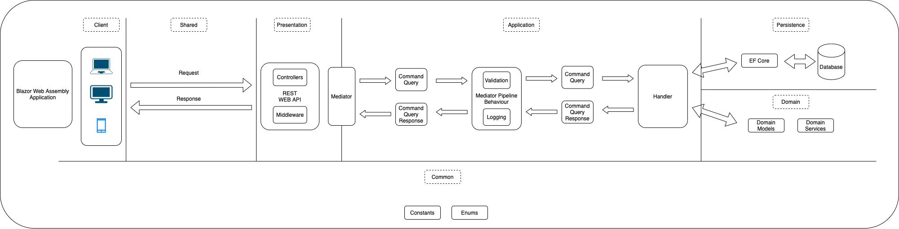

# CAN database

## Workflows

 

### Requirements:

- Make
- Docker
- Docker Compose
- .NET 5.0 SDK

## Start Application

### 1. With Docker Compose

Start: `make compose`  
Stop: `make compose arg=down`

### 2. .NET 5.0 Runtime

Start-Database: `make compose-database`  
Stop-Database: `make compose-database arg=down`  
Start-Server: `make start`  
Stop-Server: `ctrl+c`

### 3. .NET 5.0 Runtime with watch for debugging

Start-Database: `make compose-database`  
Stop-Database: `make compose-database arg=down`  
Start-Server: `make start arg=watch`  
Stop-Server: `ctrl+c`  

## Build Docker Image
Docker build latest version: `make docker-build`  
Docker build some version: `make docker-build v=1.0`  

## Tests (Unit and Integration)
Run Tests: `make test`  
Generate Code Coverage Report: `make coverage`  
 
Generated Reports Are Located in TestReportsFolder

 
 
Code Coverage Report can be viewed by navigating to TestReport Folder and opening index.html file with browser

 

## Architecture
Logical Architecture:
 

 

## Known Issues

Blazor Application is only served by server when   
environment variable ASPNETCORE_ENVIRONMENT has value development case invariant  
[Github Issue](https://github.com/dotnet/aspnetcore/issues/21992)

## Tasks

### Mandatory

- Configure Dev Environment ✅
- Add Project Backbone ✅
- Create Domain Models From dbc-examples ✅
- Configure Database ✅
- Create Application Logic ✅
  - Add .dbc Parsing ✅
  - Add CRUD ✅
- Add Application Infrastructure ✅
- Add Web Api Infrastructure ✅
- Create Web API Endpoints ✅
- Configure Communication between Client And Server ✅
- Create Client Application ✅
- Add Docker and Docker Compose ✅
- Add Integration Tests ✅
- Write Detailed Documentation ✅

### Optional

- Add Unit Tests ✅
- Add Github Workflow ✅
- Add Code Coverage Reports ✅
